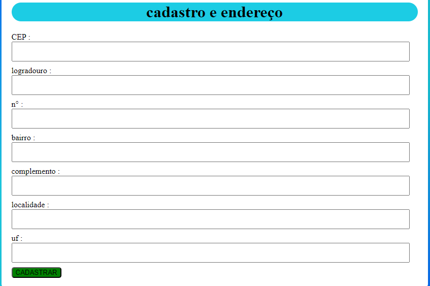

# projeto de cadastro de endereço com consumo de API (ViaCEP)

# indice

* [Descrição](#descri%C3%A7%C3%A3o)

* [Funcionalidades](#funcionalidades)

* [Fontes utilizadas ](#fontes-utilizadas)

* [explicação](#explicação-de-propriedades-do-js)

* [Autores](#autores)

## descrição
O objetivo do projeto cadastro de endereço é desenvolver um sistema de registro de usuários, incluindo coleta de informações de endereço. A interface é desenvolvida em HTML, permitindo que o usuário insira dados como CEP, por exemplo, código postal, Rua, número de residência, bairro, complemento, localidade que significa cidade e estado/UF, e escolha-o em uma lista de opções. O sistema de registro amigável é incorporado em campos de entrada de dados. usando a lógica JavaScript dedicada para interação, validação e envio de formulário pode ser executado como um arquivo separado, para garantir a segurança dos dados e sua validação, ou seja, validação CEP. Este projeto fornece uma base para melhorias e desenvolvimentos futuros.

## funcionalidades
* Validação automática de CEP: O sistema pode validar e preencher automaticamente os campos de endereço com base no CEP digitado, usando uma API como ViaCEP.

* Validação de Campos Obrigatórios: Adicione validações para garantir que todos os campos obrigatórios tenham sido preenchidos antes de permitir o envio do formulário, como CEP, número da residência e UF.

* Formato dos dados: Verifique os formatos corretos dos dados inseridos. Por exemplo, o CEP deve ter 8 dígitos e o campo “UF” do usuário deve ter apenas 2 letras do estado.

* Visual Error Feedback: Exibir feedback visual, como mensagens de erro ou a cor vermelha para destacar os campos caso o usuário não tenha preenchido corretamente.

* Preenchimento automático de endereço: Quando o CEP do usuário é preenchido, o front-end do sistema preenchea automaticamente o logradouro, o bairro, a cidade e o estado, de forma a economizar o tempo de quem preenche.

* Botão Reset: Adicione um botão de “Limpar formulário” para permitir que o usuário apague todos os dados inseridos de forma rápida.

* Responsividade: Certifique-se de que o formulário é “responsivo” e pode se adaptar bem a diferentes tamanhos de tela, incluindo os de dispositivos móveis.

## explicação de propriedades do js
### await
* A palavra-chave await do JavaScript é usada para aguardar que uma Promise seja resolvida ou rejeitada dentro de uma função assíncrona. Aguarda a execução da função até a Promise ser concluída, a resolução ou a rejeição, e, em seguida, ele retorna a promessa resultante. Usar await torna o código assíncrono muito mais simples. Com o await, você pode escrever um código que parece sincronico, mas executa operações assíncronicas.
* Requisitos para await são: 
* 1- await só poder ser usado em funções assíncronas, 
* 2- Ele aguarda a execução da função, mas não bloquem o restante do programa.acemento.

### async
* A palavra-chave async em JavaScript define uma função assíncrona, permitindo que a palavra-chave await seja usada dentro da função. As funções assíncronas têm a finalidade de tratar de tarefas que levam tempo para serem concluídas – como chamadas de API ou operações de leitura de arquivos – e não ficam bloqueando o restante do código. Quando uma função é marcada com sendo async, ela retornará automaticamente uma Promise. Dessa forma, mesmo que a função pareça retornar um valor diretamente, na verdade, ela sempre retornará uma Promise que pode ser resolvida ou rejeitada depois.

## fontes utilizadas
* encinamentos do professor [Leonardo](https://github.com/leonardorochamarista)
* [bootstrap 5](https://getbootstrap.com/)

# resumo do js

* 'use strict': Ativa o modo estrito, que torna o JavaScript mais seguro e rigoroso, ajudando a evitar erros comuns, como a utilização de variáveis não declaradas.

* Função limparformularios: Limpa os campos do formulário relacionados ao endereço, atribuindo valores vazios ('') para os campos de logradouro, bairro, localidade e UF.

* Função enumero: Verifica se uma string contém apenas números, usando uma expressão regular. Retorna true se o valor contiver apenas dígitos de 0 a 9.

* Função cepvalido: Verifica se o CEP tem 8 dígitos e se é composto apenas de números, usando a função enumero.

* Função preencherformulario: Preenche os campos do formulário com as informações do endereço retornado pela API, como logradouro, bairro, localidade e UF.

* Função pesquisarcep: Esta função assíncrona faz o seguinte:

* Limpa os campos do formulário.

* Verifica se o CEP inserido é válido.

* Faz uma requisição à API ViaCEP usando o CEP fornecido.

* Se a resposta da API for válida (CEP encontrado), preenche o formulário com os dados do endereço.

* Caso contrário, exibe uma mensagem de alerta informando que o CEP está incorreto ou não foi encontrado.

* Event Listener: Um evento de escuta é adicionado ao campo de entrada de CEP. Quando o usuário sai do campo (focusout), a função pesquisarcep é chamada para buscar e preencher os dados do endereço.

## autores
* Cristian Tayler